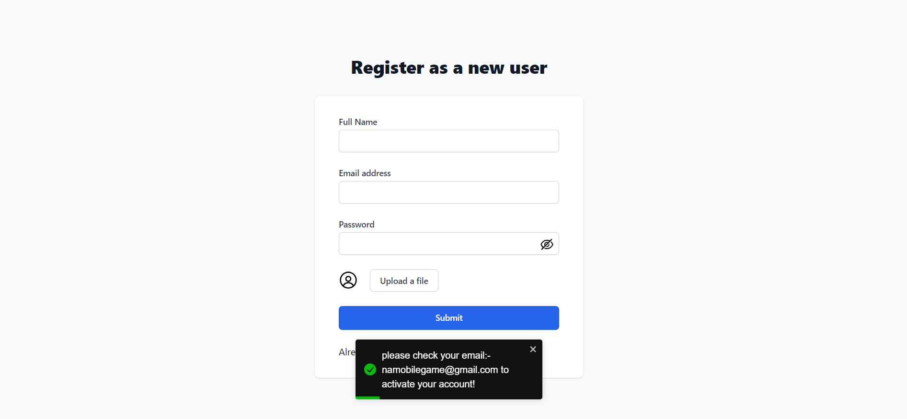
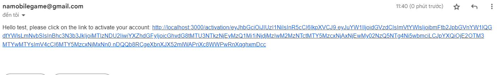
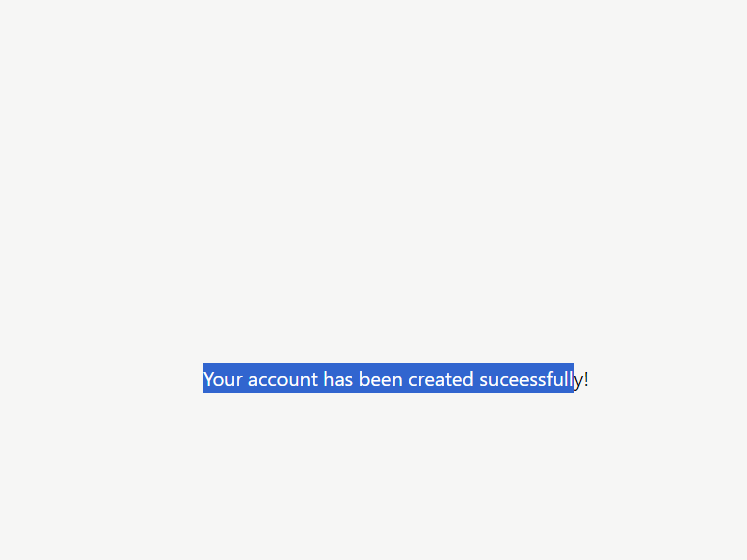
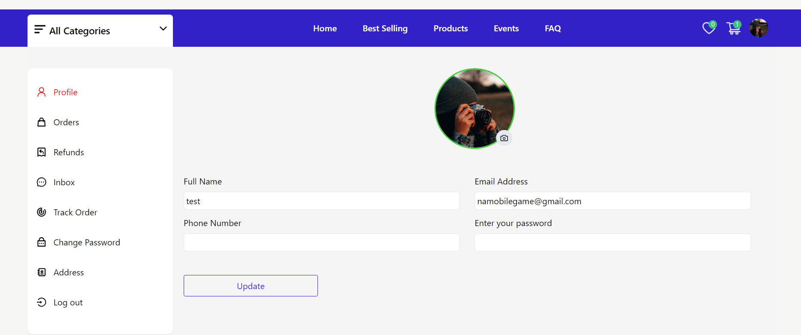
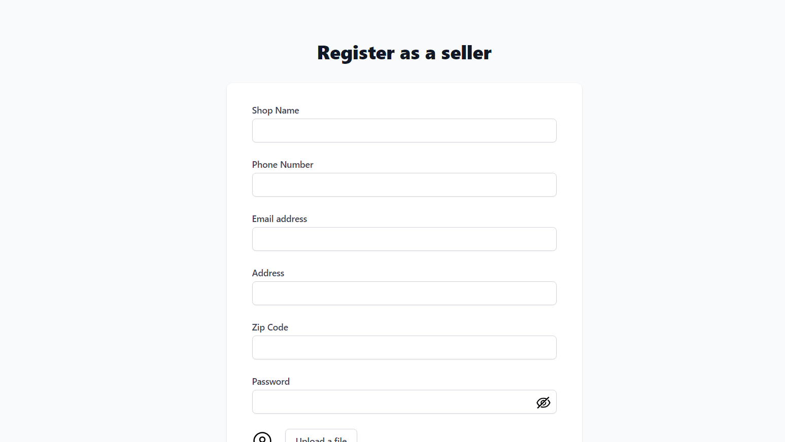
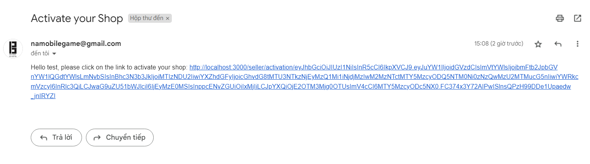
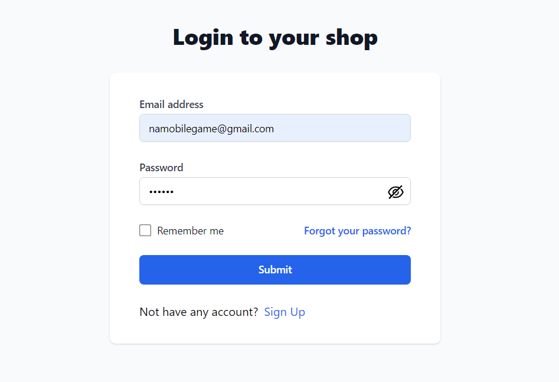
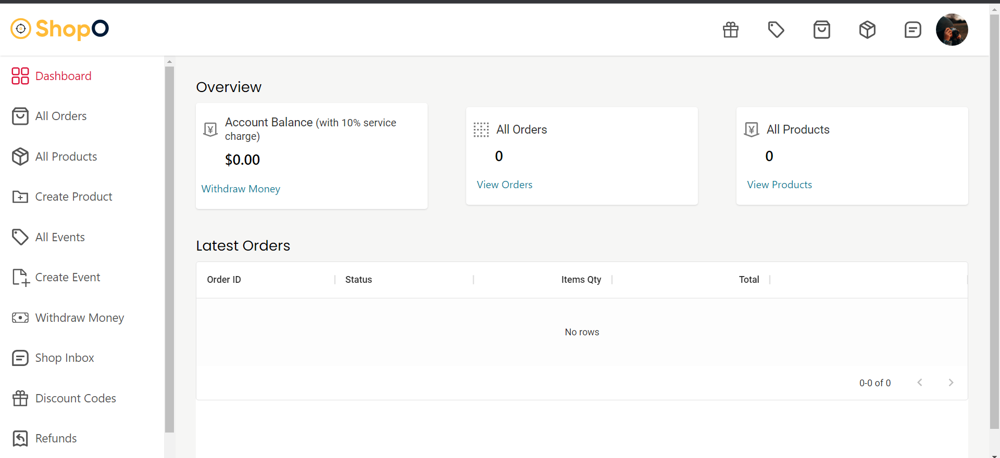
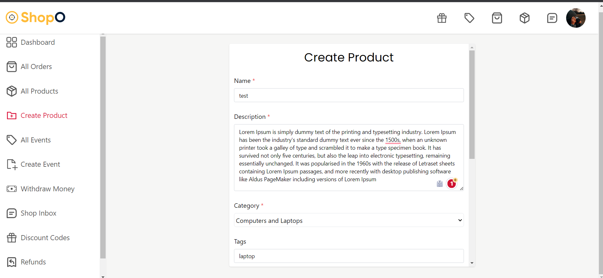

# MERN ECOMERCE

## Feature

#### Frontend
- React,Taildwindcss,Redux,MaterialUi
#### Backend
- Nodejs,Express,MongoDb,SocketIo (WebSocket),JWT,Stripe

#### Feature
- login and registration user/shop (auth,jwt,cookies,email activation)
- Shop update profile, CMS (product, event ,coupon, order, refund),statistic of balance, order , product
- User and Shop can communicate through chat 
- Payment Gateway with Stripe
- User can update profile,track order,refunds, add product to wishlist, cart (localStorage), viewing shop content,evaluate product,view product details
- Fully Responsive Web Page
- Communication with RestAPis
 

## Demo 

login/registration user

login/registration shop

crud product

